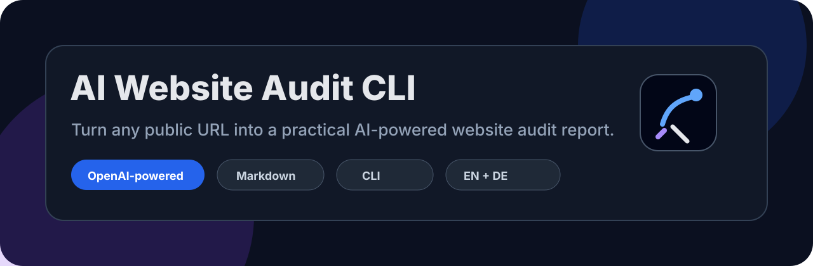

<p align="center">
  
</p>

<h1 align="center">AI Website Audit CLI</h1>

<p align="center">
  Open-source CLI for deterministic website audits and OpenAI-powered strategy reports using the modern Responses API.
</p>

<p align="center">
  <a href="#quick-start">Quick start</a> ·
  <a href="#openai-integration">OpenAI integration</a> ·
  <a href="#features">Features</a> ·
  <a href="docs/cli-reference.md">CLI reference</a> ·
  <a href="docs/openai-integration.md">OpenAI docs</a> ·
  <a href="CONTRIBUTING.md">Contributing</a>
</p>

---

## What is this?

`ai-website-audit-cli` turns a public website URL into a structured audit package:

1. **Extraction JSON** with the facts the tool found on the page.
2. **Deterministic audit JSON** with transparent rule-based checks and scores.
3. **Markdown report** generated locally or with OpenAI.
4. **Optional standalone HTML report** for sharing with clients or teams.
5. **OpenAI response metadata JSON** when the AI report is used.

The project is intentionally practical: developers, freelancers, agencies, indie hackers, and small businesses can run a quick website audit from the terminal, inspect the raw evidence, and produce a prioritized improvement plan.

The tool is MIT-licensed and designed to be easy to extend with new extractors, checks, prompts, and report formats.

## Why this exists

Many AI audit tools jump directly from a URL to vague LLM advice. This project separates the process into layers:

- **Facts first:** extract visible, inspectable data from public HTML.
- **Rules second:** run deterministic checks that can be tested and improved.
- **AI last:** use OpenAI to write a deeper report grounded in the saved evidence.

This makes the output easier to trust and easier for contributors to maintain.

## OpenAI integration

The AI layer uses the **OpenAI Python SDK** and the **Responses API** through `client.responses.create(...)`.

Default configuration:

```env
OPENAI_MODEL=gpt-5.5
OPENAI_MAX_OUTPUT_TOKENS=6000
OPENAI_REASONING_EFFORT=medium
OPENAI_STORE_RESPONSES=false
OPENAI_SERVICE_TIER=auto
```

The default model is `gpt-5.5` because this repository is meant to demonstrate a current production-style OpenAI integration. For cheaper or faster local testing, use:

```bash
ai-website-audit audit https://example.com --model gpt-5.4-mini
```

The OpenAI call lives in one clear file:

```text
src/ai_website_audit/openai_client.py
```

It sends:

- the extracted public website facts
- deterministic scores and checks
- the selected report language
- strict system instructions to avoid hallucinated claims

It saves:

- generated Markdown report
- response ID when available
- model used
- API endpoint name
- usage metadata when returned by the SDK
- latency
- reasoning effort
- response storage setting

Privacy-first default: `OPENAI_STORE_RESPONSES=false`.

## Features

### Website extraction

- public HTML fetch with configurable user agent
- redirect-aware final URL capture
- title and title length
- meta description and length
- canonical URL
- meta robots
- viewport tag
- HTML language
- H1/H2/H3 extraction
- internal and external links
- broken/empty/javascript link counting
- image count
- missing alt text count
- lazy-loaded image count
- images without dimensions count
- forms, inputs and buttons
- likely CTA detection
- Open Graph tags
- Twitter/X card tags
- JSON-LD schema type detection
- email and phone mentions
- word count and paragraph count
- readable text extraction
- text-to-HTML ratio
- HTML response size
- initial fetch time
- cookie/privacy/terms/pricing/testimonial/FAQ signals
- simple technology hints like WordPress, Shopify, Webflow, Next.js, React and GTM
- optional conservative same-domain crawl

### Deterministic audit

- SEO score
- content score
- UX and conversion score
- accessibility score
- trust score
- performance score
- overall score
- rule-based findings with severity
- quick wins
- risk flags
- opportunities
- multi-page duplicate title/meta checks

### AI-assisted report

- OpenAI Responses API
- current model support, including `gpt-5.5` and smaller model overrides
- reasoning effort option for supported models
- explicit max output token control
- storage control with `--store-response/--no-store-response`
- English and German prompt templates
- evidence-grounded report structure
- developer implementation checklist

### Output formats

- Markdown report
- HTML report
- extraction JSON
- deterministic audit JSON
- OpenAI response metadata JSON

## Quick start

### 1. Clone and install

```bash
git clone https://github.com/your-username/ai-website-audit-cli.git
cd ai-website-audit-cli
python -m venv .venv
source .venv/bin/activate  # Windows: .venv\\Scripts\\activate
pip install -e .
```

### 2. Run without OpenAI

```bash
ai-website-audit inspect https://example.com --html
```

This produces a deterministic local audit and does not require an API key.

### 3. Run with OpenAI

```bash
cp .env.example .env
# Add OPENAI_API_KEY to .env
ai-website-audit audit https://example.com --language en --html
```

### 4. Use a smaller model for cheaper testing

```bash
ai-website-audit audit https://example.com \
  --language en \
  --model gpt-5.4-mini \
  --max-output-tokens 4000 \
  --html
```

### 5. Generate a German report

```bash
ai-website-audit audit https://example.com --language de --crawl --max-pages 3 --html
```

### 6. Show current config

```bash
ai-website-audit show-config
```

## Example output files

```text
reports/
├── example-com-audit.md
├── example-com-audit.html
├── example-com-extraction.json
├── example-com-deterministic-audit.json
└── example-com-openai-response.json
```

## Example CLI output

```text
Deterministic Audit Score
┏━━━━━━━━━━━━━━━━━┳━━━━━━━━━┓
┃ Area            ┃   Score ┃
┡━━━━━━━━━━━━━━━━━╇━━━━━━━━━┩
│ Overall         │  84/100 │
│ SEO             │  86/100 │
│ Content         │  91/100 │
│ UX & Conversion │  82/100 │
│ Accessibility   │  88/100 │
│ Trust           │  76/100 │
│ Performance     │  85/100 │
└─────────────────┴─────────┘
```

## Configuration

Create `.env` from `.env.example`:

```env
OPENAI_API_KEY=sk-your-key
OPENAI_MODEL=gpt-5.5
OPENAI_MAX_OUTPUT_TOKENS=6000
OPENAI_REASONING_EFFORT=medium
OPENAI_STORE_RESPONSES=false
OPENAI_SERVICE_TIER=auto
OPENAI_TEMPERATURE=
REQUEST_TIMEOUT_SECONDS=20
USER_AGENT=AIWebsiteAuditCLI/1.0.0 (+https://github.com/your-username/ai-website-audit-cli)
```

| Variable | Required | Default | Description |
|---|---:|---|---|
| `OPENAI_API_KEY` | only for AI reports | none | OpenAI API key |
| `OPENAI_MODEL` | no | `gpt-5.5` | Model for AI reports |
| `OPENAI_MAX_OUTPUT_TOKENS` | no | `6000` | Maximum output tokens |
| `OPENAI_REASONING_EFFORT` | no | `medium` | Reasoning effort for supported models |
| `OPENAI_STORE_RESPONSES` | no | `false` | Whether OpenAI may store response objects |
| `OPENAI_SERVICE_TIER` | no | `auto` | OpenAI service tier |
| `OPENAI_TEMPERATURE` | no | empty | Optional temperature override |
| `REQUEST_TIMEOUT_SECONDS` | no | `20` | HTTP timeout for website fetches |
| `USER_AGENT` | no | project UA | User agent used for public requests |

## CLI commands

### `inspect`

Local deterministic audit only:

```bash
ai-website-audit inspect https://example.com --html
```

### `audit`

Full audit. Uses OpenAI unless `--no-ai` is passed:

```bash
ai-website-audit audit https://example.com --language en --html
```

Important options:

```bash
--language en|de
--model gpt-5.5
--reasoning-effort low|medium|high|xhigh
--max-output-tokens 6000
--store-response / --no-store-response
--crawl
--max-pages 5
--no-ai
--html
--verbose
```

### `show-config`

```bash
ai-website-audit show-config
```

Prints runtime config without exposing secrets.

## Project structure

```text
ai-website-audit-cli/
├── src/ai_website_audit/
│   ├── analyzer.py       # deterministic checks and scoring
│   ├── cli.py            # Typer CLI commands
│   ├── config.py         # environment settings
│   ├── extractor.py      # HTML extraction and crawler
│   ├── models.py         # dataclasses for extraction/audit data
│   ├── openai_client.py  # OpenAI Responses API integration
│   ├── prompts.py        # prompt assembly
│   ├── report.py         # Markdown/HTML/JSON outputs
│   └── utils.py          # URL, slug and text helpers
├── prompts/              # English and German prompt templates
├── docs/                 # architecture, CLI, OpenAI integration, roadmap
├── examples/             # sample reports and JSON artifacts
├── tests/                # pytest test suite
├── .github/              # issue templates and CI workflow
├── AGENTS.md             # instructions for Codex/AI coding agents
├── Dockerfile
├── Makefile
└── README.md
```

## Development

```bash
make install
make test
make inspect
```

Or manually:

```bash
pip install -e . pytest
pytest
```

## Docker

```bash
docker build -t ai-website-audit-cli .
docker run --rm ai-website-audit-cli inspect https://example.com --html
```

For OpenAI-powered audits:

```bash
docker run --rm -e OPENAI_API_KEY=$OPENAI_API_KEY ai-website-audit-cli audit https://example.com --language en
```

## Roadmap

See [`docs/roadmap.md`](docs/roadmap.md). Good first issues include:

- add Lighthouse JSON import
- add sitemap.xml discovery
- add robots.txt inspection
- add broken-link verification mode
- add CSV export
- add JUnit/SARIF output for CI pipelines
- add more language prompt templates
- add plugin-style custom checks

## Contributing

Contributions are welcome. See [`CONTRIBUTING.md`](CONTRIBUTING.md).

Good contributions include:

- new deterministic checks
- better extraction logic
- improved prompts
- more tests
- bug reports with reproducible URLs
- documentation improvements
- examples from real public websites

## Security and privacy

See [`SECURITY.md`](SECURITY.md).

Important defaults:

- the tool only fetches public URLs provided by the user
- API keys are read from environment variables
- `.env` is ignored by git
- OpenAI response storage is disabled by default
- raw extraction JSON is saved locally so users can inspect what was sent to the AI layer

## License

MIT. See [`LICENSE`](LICENSE).
